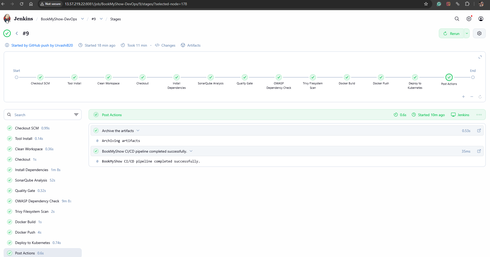
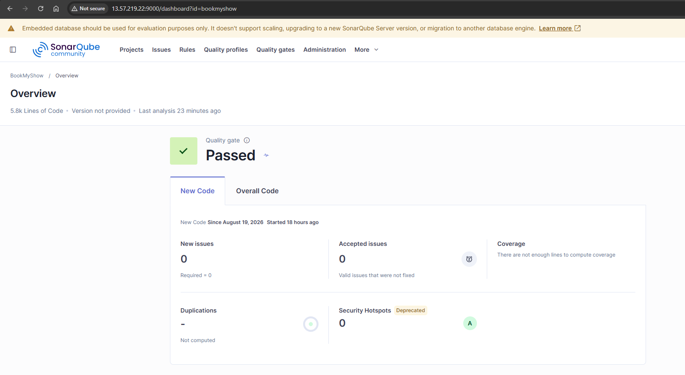
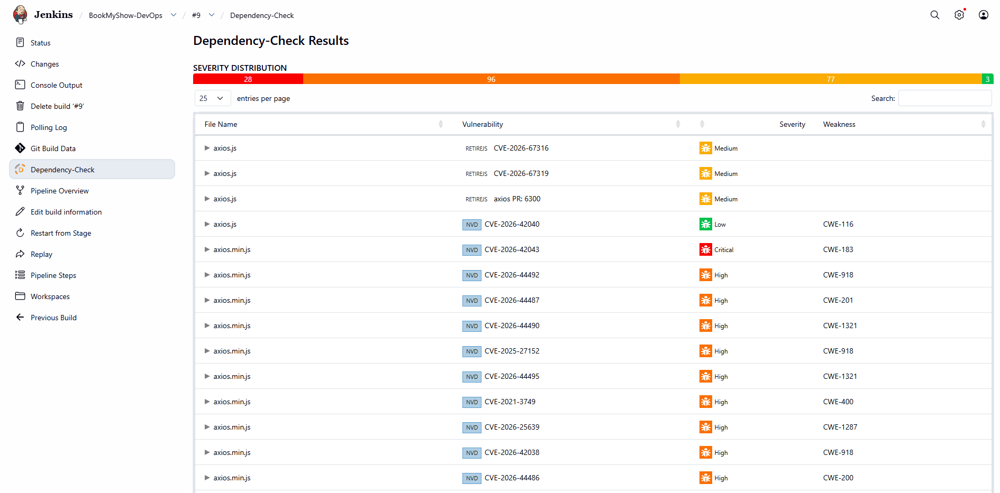
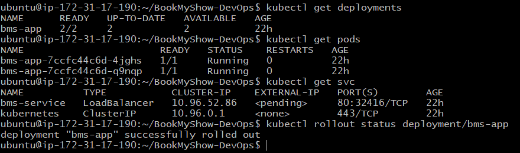
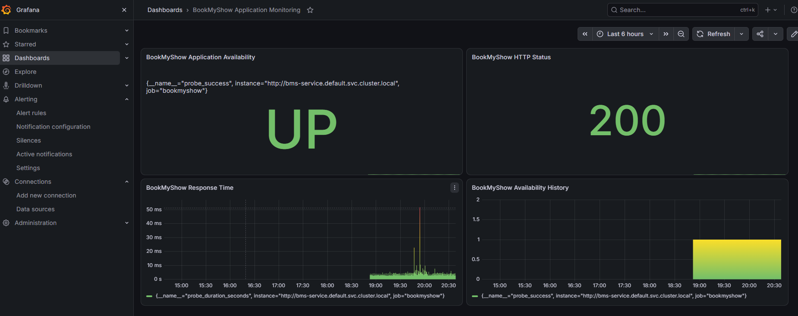
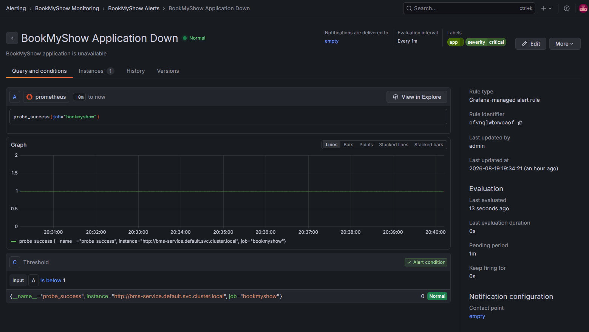
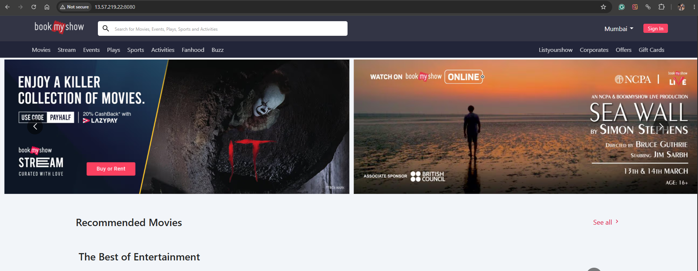
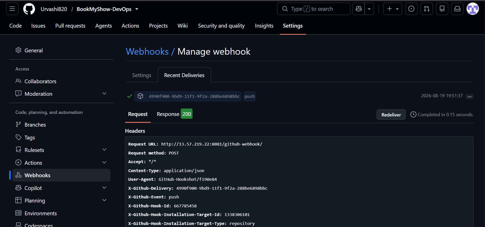

# BookMyShow DevOps

> End-to-end DevOps implementation for a BookMyShow-style web application using CI/CD, Docker, Kubernetes, security scanning, and application monitoring.

---

## 🚀 Project Overview

This project demonstrates an automated DevOps workflow that takes the application from source code to a deployed and monitored Kubernetes application.

```text
GitHub
   ↓
Jenkins CI/CD
   ↓
SonarQube
   ↓
OWASP + Trivy
   ↓
Docker
   ↓
Docker Hub
   ↓
Kubernetes
   ↓
Prometheus + Blackbox Exporter
   ↓
Grafana + Alerting
```
## 🏗️ DevOps Architecture

```text
                    ┌──────────────┐
                    │    GitHub    │
                    └──────┬───────┘
                           │
                           ▼
                    ┌──────────────┐
                    │    Jenkins   │
                    └──────┬───────┘
                           │
             ┌─────────────┼─────────────┐
             ▼             ▼             ▼
        ┌─────────┐  ┌──────────┐  ┌──────────┐
        │SonarQube│  │   OWASP  │  │  Trivy   │
        └─────────┘  └──────────┘  └──────────┘
                           │
                           ▼
                    ┌──────────────┐
                    │    Docker    │
                    └──────┬───────┘
                           │
                           ▼
                    ┌──────────────┐
                    │  Docker Hub  │
                    └──────┬───────┘
                           │
                           ▼
                    ┌──────────────┐
                    │  Kubernetes  │
                    └──────┬───────┘
                           │
                ┌──────────┴──────────┐
                ▼                     ▼
        ┌──────────────┐      ┌──────────────┐
        │  Prometheus  │─────▶│    Grafana   │
        └──────┬───────┘      └──────────────┘
               │
               ▼
        ┌──────────────────┐
        │ Blackbox Exporter│
        └──────────────────┘
```
## 🛠️ Technology Stack
| Area | Tools |
|------|-------|
| Source Control | Git, GitHub |
| CI/CD | Jenkins |
| Code Quality | SonarQube |
| Security | OWASP Dependency-Check, Trivy |
| Containerization | Docker |
| Registry | Docker Hub |
| Orchestration | Kubernetes, Minikube |
| Monitoring | Prometheus, Blackbox Exporter |
| Visualization | Grafana |
| Application | Nginx / BookMyShow Web App |

## 🔄 CI/CD Pipeline
The Jenkins pipeline automates:

- Source code checkout
- Dependency installation
- SonarQube analysis
- Quality Gate validation
- OWASP Dependency-Check
- Trivy filesystem scanning
- Docker image build
- Docker Hub push
- Kubernetes deployment
- Deployment verification

## 🔐 Security & Code Quality
#### SonarQube: 
The application successfully passed the configured SonarQube Quality Gate.

#### Security Scanning: 
The pipeline integrates:
- OWASP Dependency-Check for dependency vulnerabilities
- Trivy for filesystem security scanning

## ☸️ Kubernetes Deployment
The application is containerized with Docker and deployed to Kubernetes using version-controlled manifests.

The deployment uses multiple application replicas and is verified through Kubernetes rollout checks.

## 📊 Monitoring & Alerting
Prometheus and Blackbox Exporter monitor the availability and HTTP health of the application.

#### Grafana provides:

- Application availability
- HTTP status
- Response time
- Availability history
- Application alerting

## 🔗 GitHub Webhook Integration
GitHub push events automatically trigger the Jenkins pipeline through a webhook.

## ✅ Project Highlights
- Automated CI/CD pipeline
- Quality Gate enforcement
- Dependency and filesystem security scanning
- Docker image automation
- Kubernetes deployment
- Prometheus-based monitoring
- Grafana dashboard and alerting
- GitHub-to-Jenkins webhook automation

## ⚙️ How It Works

1. Developer pushes code to GitHub.
2. GitHub webhook triggers Jenkins.
3. Jenkins installs dependencies and performs code quality analysis.
4. OWASP Dependency-Check and Trivy perform security scanning.
5. Jenkins builds and pushes the Docker image to Docker Hub.
6. Kubernetes deploys the application.
7. Prometheus and Blackbox Exporter monitor application health.
8. Grafana visualizes metrics and provides alerting.

## 📈 Results

- Jenkins CI/CD pipeline completed successfully.
- SonarQube Quality Gate passed.
- Docker image successfully pushed to Docker Hub.
- Kubernetes deployment completed successfully.
- Application health monitored through Prometheus and Blackbox Exporter.
- Grafana dashboard and alert rule configured successfully.
- GitHub webhook successfully triggered Jenkins.

## 📁 Repository Structure

```text
BookMyShow-DevOps/
├── bookmyshow-app/
├── screenshots/
├── Jenkinsfile
├── deployment.yml
├── service.yml
├── prometheus-config.yaml
├── prometheus-deployment.yaml
├── prometheus-service.yaml
├── grafana-deployment.yaml
├── grafana-service.yaml
├── blackbox-deployment.yaml
├── blackbox-service.yaml
└── sonar-project.properties
```
## 📸 Project Evidence

### CI/CD Pipeline



### Code Quality



### Security Scanning



### Kubernetes Deployment



### Monitoring



### Alerting



### Application



### GitHub Webhook



> Additional implementation screenshots are available in the `screenshots/` directory.
